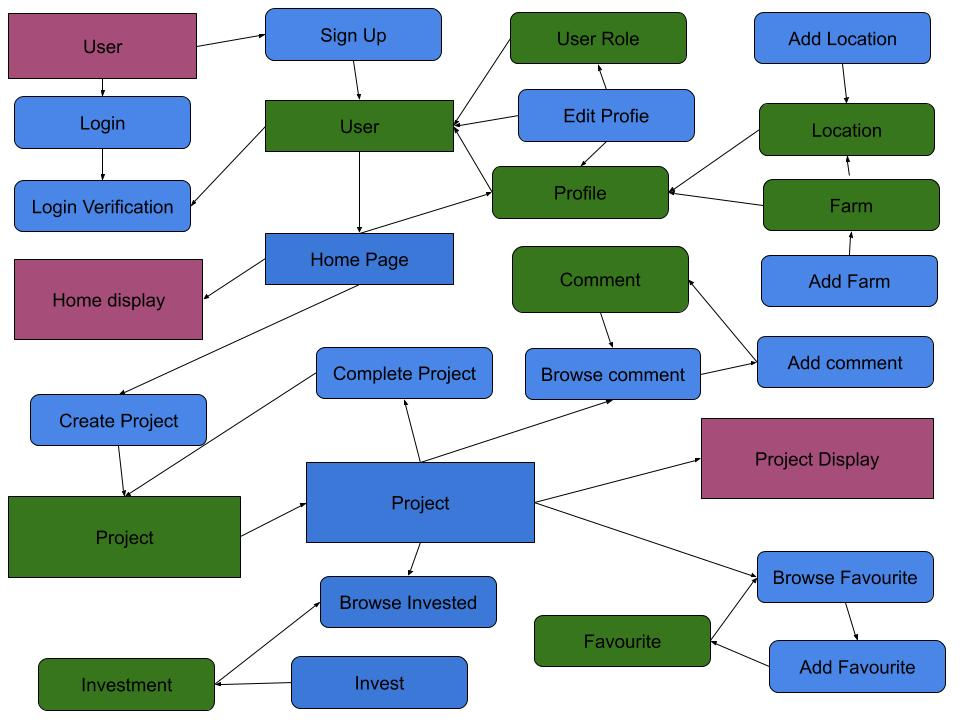
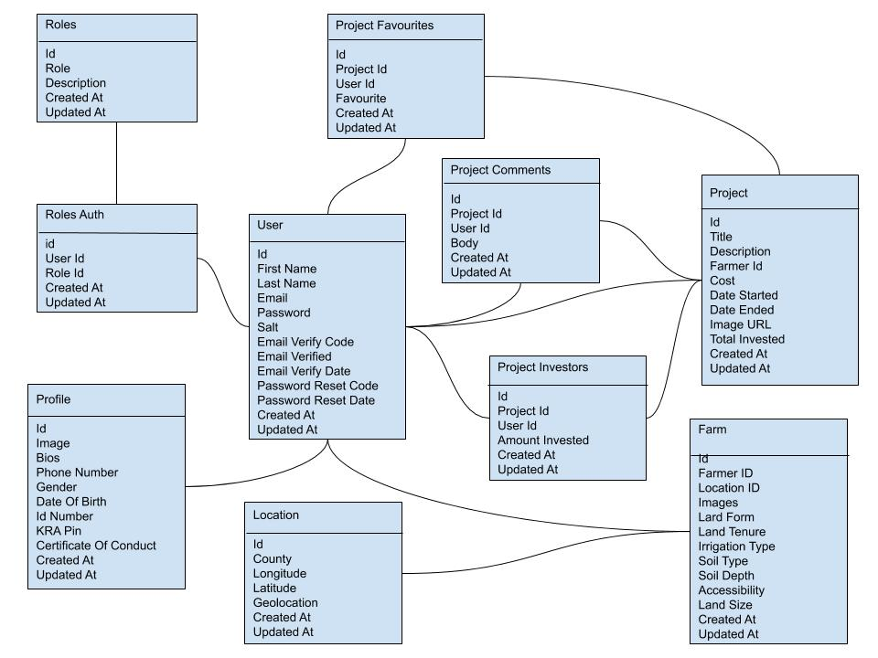

# Agrivesty

 

> Agrivesty is an Crowdfunding System that help farmers to raise farming capital from available investor. In this platform, a user can either create a crowdfunding farming project or invest money towards their favorite farming projects. The platform also provides social features where users can leave their comments and discuss projects and like a project.

## Tech Stack

-   NodeJS

-   Express

-   PostgreSQL Database

-   ReactJs

-   Javascript
**General functionality:**

-   [x] Authenticate users (Login & Logout)

-   [x] Create, Read, Update and Delete users (sign up, settings/updating & deleting profile )

-   [x] Create, Read, Update and Delete farm and location.

-   [x] Create, Update and Delete farming projects, comments, favourites.

-   [x] GET and display paginated lists of crowdfunding farming project (individual & other requests)

-   [x] Users can favorite and comment on clowdfunding farming project.

## Kindly Read the instruction bellow
**SETUP**
-   [x] Click on Fork at the top right corner
-   [x] Clone your forked repository to our local machine
-   [x] cd into the cloned folder | cd Team-179-Backend
-   [x] Create a new git branch for each new feature. This is a good practice because in the future your will further update the branch after some discussions. e.g git checkout -b feature/user-login
-   [x] Git push changes into your remote repository. Make sure you are on the branch you created for the new feature
-   [x] In your forked repository Github page, change to the branch with the new feature and then hit the "Pull Request" button

**Running the project locally**
-   [x] npm install
-   [x] Copy env-example to .env and fill all the fields with your credentials
-   [x] npm run dev
-   [x] Go to http://localhost:4000

## Data Flow Diagram

## Database Design Schema Diagram

## Documentation Translation
Find the api documentation on: https://agri-vesty.herokuapp.com/api-docs or http://localhost:4000/api-docs

 
